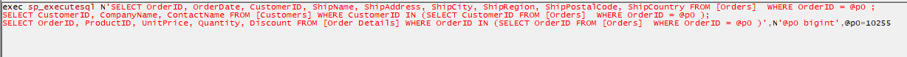
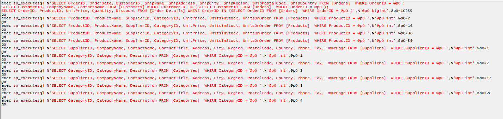
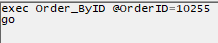
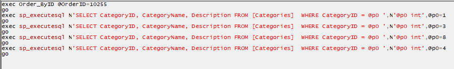

# MereCatalog

## Goal

A basic ORM framework with as close to POCO as possible domain objects. i.e. minimal decorations through attributes, if any. Associated domain objects (i.e. through foreign key relationships) should be populated automatically where intuitively possible (and helped along through attributes if necessary).


## Solution

Reflection is used on domain object classes to determine database fields and associated domain objects. 

Storage is abstracted to be able to support multiple storage technologies in future if needed. SQL Server support is currently provided. 

When a Read operation is called for a domain object, the reflected properties are iterated over and if non-"primitive" * populated in a queue structure.  

Associated domain objects can be recursively iterated over so care should be taken when using this. As an unknown domain object is found, a new DBCommand is generated and ran. 

This solution is largely untested and is provided "as is". It was more of an exercise in playing around with Reflection than a serious attempt at a production ready ORM.

*"primitive" - as in C# primitive data type but also including extra data types such as decimal, datetime...


## Usage

### DAL

Setup DAL classes. Here's a partial implementation of a Northwind table.

``` C#
[DBTable(TableName="Orders")]
public class Order
{
	public int OrderID { get; set; }
	public DateTime OrderDate { get; set; }

	public string CustomerID { get; set; }
	public Customer Customer { get; set; }

	public OrderDetail[] OrderDetails { get; set; }

	public string ShipName { get; set; }
	public string ShipAddress { get; set; }
	public string ShipCity { get; set; }
	public string ShipRegion { get; set; }
	public string ShipPostalCode { get; set; }
	public string ShipCountry { get; set; }
			
	public string ShipAddressFull { 
		get { 
			return string.Format("{0}\r\n{1}\r\n{2}, {3}, {4}\r\n{5}", ShipName, ShipAddress, ShipCity, ShipRegion, ShipPostalCode, ShipCountry); 
		} 
	}
}
```

Where necessary, attributes can be used to clarify how the class should be treated. And in this case, an attribute is required to clarify the table name, due to plurality.

When a read query is executed, the various properties would be populated and, by default, the Customer object and the OrderDetails array would be added to a queue and populated soon after.  The ShipAddressFull property is a non-writeable so is ignored.


### BLL

A basic BLL is available to provide some basic CRUD operations and can easily be extended. This provides static ByID, Save and Delete methods.  

``` C#
public class Orders : BLLSQLServer<Order>
{
	...
}
```

### Examples

From the above BLL example (with no added methods), the following is possible:

``` C#
Order order = Orders.ByID(10255);
```

By default, this will cause the Order with ID 10255 to loaded with all it's associated domain objects included. Any of their associated domain objects would not be loaded however.

The Profile for this query looks like the following (please note that a complete ORM for Northwind was not made, just enough for this demonstration).

[](./images/defaultLoad.PNG)

Note that one DBCommand is executing three statements.

At this point, all Order properties are accessible, e.g.

``` C#
DateTime dt = Order.OrderDate;
string custName = Order.Customer.CompanyName;
```

However no associated domain objects on the Customer or OrderDetails properties would be available. e.g. Order Details records or Customer Demographic records.

To automatically load these, you must indicate that you wish load recursively any associated objects that are found. This can be quite dangerous as it could end up generating and executing MANY DBCommands

``` C#
Order order = Orders.ByID(10255, recursiveLoad: true);
```

[](./images/RecursiveLoad.PNG)

This further loads the Product, Supplier and Category details as needed. If an ID for one of these is required more than once, the result will have been cached and the DBCOmmand is not repeated.

If wishing to optimize this (and using SQL Server), you can use a crafted Stored Procedure to load this full record in a way that doesn't require further DBCommands to execute, e.g. By adding a method to the Orders BLL object (shown here without error handling):

``` C#
public static Order ByIDSP(long id) {
	var result = MereCataloger.LoadFromSP<Order>("Order_ByID", new[] { typeof(Order), typeof(Customer), typeof(OrderDetail), typeof(Product), typeof(Supplier), typeof(Category) }, true, "OrderID", id);
	return result.Result[0];
}
```
[](./images/StoredProcFull.PNG)

The type array indicates the order of types to be returned as result sets from the Stored Procedure. And the bool indicates whether to recursively load associated domain objects that were missed by the stored procedure. Here's what the Profile would look like if the Stored Procedure didn't have the Categories load and ther recursion was set to true:

[](./images/StoredProcIncomplete.PNG)

For reference, the SP above is something like the following (with the last SELECT optional commented out to achieve the discussion above):

``` SQL 
CREATE PROCEDURE [dbo].[Order_ByID]
	@OrderID int
AS
BEGIN
	SELECT * FROM [Orders] WHERE OrderID = @OrderID
	SELECT * FROM Customers c JOIN [Orders] o ON o.CustomerID = c.CustomerID WHERE o.OrderID = @OrderID
	SELECT * FROM [Order Details] od WHERE od.OrderID = @OrderID
	SELECT * FROM Products p WHERE ProductID IN (SELECT ProductID FROM [Order Details] od WHERE od.OrderID = @OrderID)
	SELECT * FROM Suppliers s WHERE SupplierID IN (SELECT SupplierID FROM Products p WHERE ProductID IN (SELECT ProductID FROM [Order Details] od WHERE od.OrderID = @OrderID))
	SELECT * FROM Categories c WHERE CategoryID IN (SELECT CategoryID FROM Products p WHERE ProductID IN (SELECT ProductID FROM [Order Details] od WHERE od.OrderID = @OrderID))
END
```

### Attributes

The Order class example above demonstrates the DBTable attribute but there's also a DBProperty attribute useful for specifying:
- the ID Field if not obvious/derivable
``` C#
[DBProperty(IDField=true)]
public long StrangeIDFieldName { get; set; }
```
- Exclude attribute for properties that you want ignored
``` C#
[DBProperty(Exclude=true)]
public long ExcludeMe { get; set; }
```
- Defining the foreign relationship key if not obvious/derivable
``` C#
[DBProperty(KeyID="ParentID")]
public TreeNode ParentTreeNode { get; set; }
```

## Future work

- ~~BLL assumes primary key is long data type.~~
  - primary key type is now a type parameter on the BLLBase class
- robust error handling
  - ~~Crashes when an unknown property cannot successfully be retrieved from the data source~~
- uses minvalues for DBNull mapping. Nullable values might be neater.
  - added initial support for Nullable values.
- more abstracted database connectivity. It's defaulting to SQL server.
- Lazy loading optional for associated domain objects
- Linq and/or Lambda style querying
- better sql querying abilities (<, >, <=, >=, like, etc)
- Caching of entire tables, or results for certain parameters. Probably defined through the DBTable attribute.